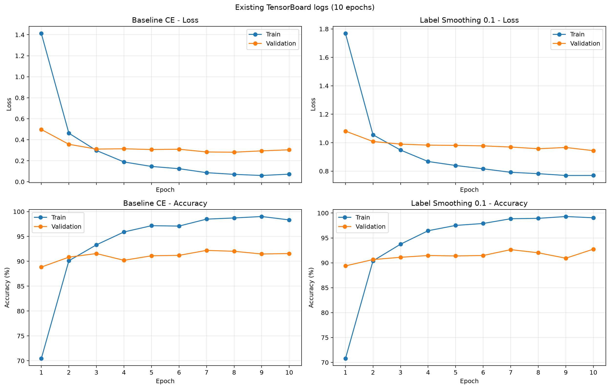

# Pet Classifier

基于 ImageNet 预训练 ResNet18，对 Oxford-IIIT Pet 数据集中的 37 个猫狗品种进行细粒度图像分类。

本项目比较两种损失函数：

- Baseline：标准交叉熵损失
- 改进组：Label Smoothing 0.1

仓库包含训练、测试评估、Top-1/Top-5、Macro-F1、混淆矩阵、Grad-CAM 和 TensorBoard 曲线。

## 实验结果

| 实验 | 最佳 Epoch | 验证准确率 | 测试 Top-1 | 测试 Top-5 | Macro-F1 |
|---|---:|---:|---:|---:|---:|
| Baseline CE | 7 | 92.20% | 91.02% | 99.18% | 0.9098 |
| Label Smoothing 0.1 | 10 | 92.74% | 91.30% | 98.91% | 0.9130 |

Label Smoothing 的测试 Top-1 提升约 0.28 个百分点，Macro-F1 提升约 0.0032，Top-5 略有下降。

以上是固定数据划分和固定随机种子下的一次实验结果。由于没有进行多个随机种子的重复实验，因此不宣称结果具有统计显著性。

## 数据集与划分

使用 Oxford-IIIT Pet 数据集，共 7349 张图片、37 个类别。

项目将官方 `trainval` 和 `test` 合并后，使用固定种子 42 进行分层划分：

| 数据集 | 图片数量 | 占比 |
|---|---:|---:|
| 训练集 | 5144 | 70.00% |
| 验证集 | 1102 | 15.00% |
| 测试集 | 1103 | 15.01% |

训练集预处理：

```text
Resize(256)
RandomCrop(224)
RandomHorizontalFlip()
ToTensor()
ImageNet Normalize
```

验证集和测试集预处理：

```text
Resize(256)
CenterCrop(224)
ToTensor()
ImageNet Normalize
```

验证集和测试集不使用随机裁剪或随机翻转。

## 项目结构

```text
pet-classifier/
├── data/
│   ├── __init__.py
│   └── dataset.py
├── models/
│   ├── __init__.py
│   └── model.py
├── utils/
│   ├── __init__.py
│   ├── checkpoints.py
│   ├── metrics.py
│   └── gradcam.py
├── tools/
│   └── export_tensorboard_curves.py
├── outputs/
├── runs/
├── train.py
├── evaluate.py
├── requirements.txt
├── .gitignore
└── README.md
```

主要文件：

- `data/dataset.py`：数据下载、分层划分、Transform 和 DataLoader
- `models/model.py`：ResNet18 模型及 37 分类输出层
- `train.py`：训练入口
- `evaluate.py`：测试集指标与混淆矩阵
- `utils/metrics.py`：Top-1、Top-5、Macro-F1 和混淆矩阵工具
- `utils/gradcam.py`：Grad-CAM 计算与可视化
- `tools/export_tensorboard_curves.py`：从 TensorBoard 日志导出训练曲线

## 环境要求

本项目测试环境：

- Python 3.12
- PyTorch 2.13.0
- torchvision 0.28.0
- CUDA 12.6
- Windows 11
- NVIDIA GeForce RTX 4060 Laptop GPU

没有 CUDA GPU 时可以使用 CPU，但训练速度会明显变慢。

## 克隆仓库

```powershell
git clone https://github.com/peak9331/pet-classifier.git
Set-Location .\pet-classifier
```

## 创建环境

使用 Conda：

```powershell
conda create -n pet-classifier python=3.12 -y
conda activate pet-classifier
python -m pip install -r .\requirements.txt
```

检查依赖：

```powershell
python -m pip check
```

## 下载并检查数据集

运行：

```powershell
python -c "from data.dataset import create_dataloaders; create_dataloaders(download=True)"
```

数据将下载到：

```text
datasets/oxford-iiit-pet/
```

运行成功后应显示：

```text
总数据：7349
训练集：5144
验证集：1102
测试集：1103
类别数：37
```

后续训练和评估默认读取本地数据，不会重复下载。

## 训练 Baseline

```powershell
python .\train.py `
    --experiment-name baseline_ce `
    --epochs 10 `
    --batch-size 32 `
    --lr 1e-4 `
    --weight-decay 0.01 `
    --label-smoothing 0.0 `
    --seed 42 `
    --num-workers 0
```

最佳模型保存在：

```text
checkpoints/baseline_ce_best.pth
```

## 训练 Label Smoothing 0.1

```powershell
python .\train.py `
    --experiment-name label_smoothing_01 `
    --epochs 10 `
    --batch-size 32 `
    --lr 1e-4 `
    --weight-decay 0.01 `
    --label-smoothing 0.1 `
    --seed 42 `
    --num-workers 0
```

最佳模型保存在：

```text
checkpoints/label_smoothing_01_best.pth
```

如果同名 checkpoint 已存在，训练程序默认拒绝覆盖。

由于 GPU、驱动和底层计算存在差异，不同设备上的结果可能出现轻微波动。

## 测试评估

完成两组训练后运行：

```powershell
python .\evaluate.py
```

程序将计算：

- 测试集 Top-1 Accuracy
- 测试集 Top-5 Accuracy
- 测试集 Macro-F1
- 数量混淆矩阵
- 归一化混淆矩阵
- 最容易混淆的类别组合

复现结果保存在：

```text
outputs/reproduced_experiment_results.csv
```

## Grad-CAM

运行：

```powershell
python -m utils.gradcam
```

默认读取：

```text
checkpoints/label_smoothing_01_best.pth
```

程序会寻找：

- 一张正确分类的 Bengal 图片
- 一张被误判为 Egyptian Mau 的 Bengal 图片

并生成 Grad-CAM 热力图。

如果需要覆盖已有 Grad-CAM 图片：

```powershell
python -m utils.gradcam --overwrite
```

## TensorBoard

查看训练日志：

```powershell
tensorboard --logdir .\runs --port 6006
```

浏览器访问：

```text
http://localhost:6006
```

导出新的训练曲线：

```powershell
python .\tools\export_tensorboard_curves.py `
    --output .\outputs\training_curves_reproduced.png
```

## 可视化结果

### 训练曲线



### 数量混淆矩阵


### 归一化混淆矩阵


### Grad-CAM 正确案例


### Grad-CAM 错误案例


## 最容易混淆的类别

Label Smoothing 模型中错误次数最多的类别组合：

| 排名 | 类别组合 | 双向错误数 |
|---:|---|---:|
| 1 | Bengal ↔ Egyptian Mau | 10 |
| 2 | American Pit Bull Terrier ↔ Staffordshire Bull Terrier | 9 |
| 3 | Birman ↔ Ragdoll | 5 |

完整结果见：

```text
outputs/top_confusions_label_smoothing_01.csv
```

## 说明

数据集和模型 checkpoint 体积较大，不包含在 GitHub 仓库中。

- 数据集可以通过项目提供的命令自动下载。
- checkpoint 可以通过训练命令重新生成。
- 仓库中保留实验指标、训练曲线、混淆矩阵、Grad-CAM 图片和两次正式实验的 TensorBoard 日志。