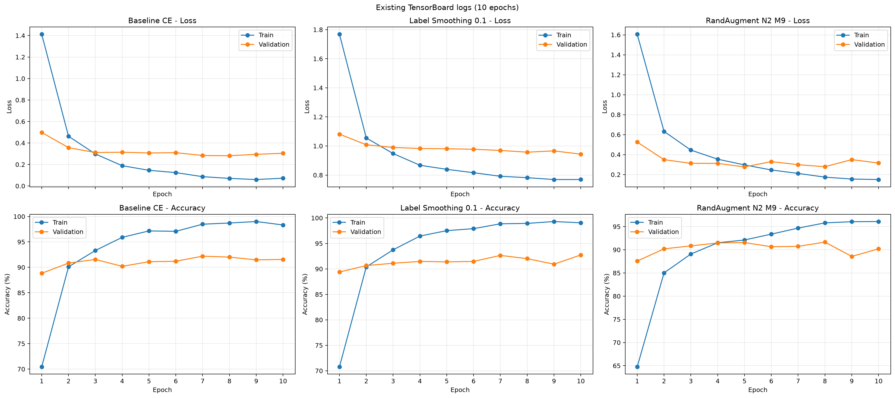
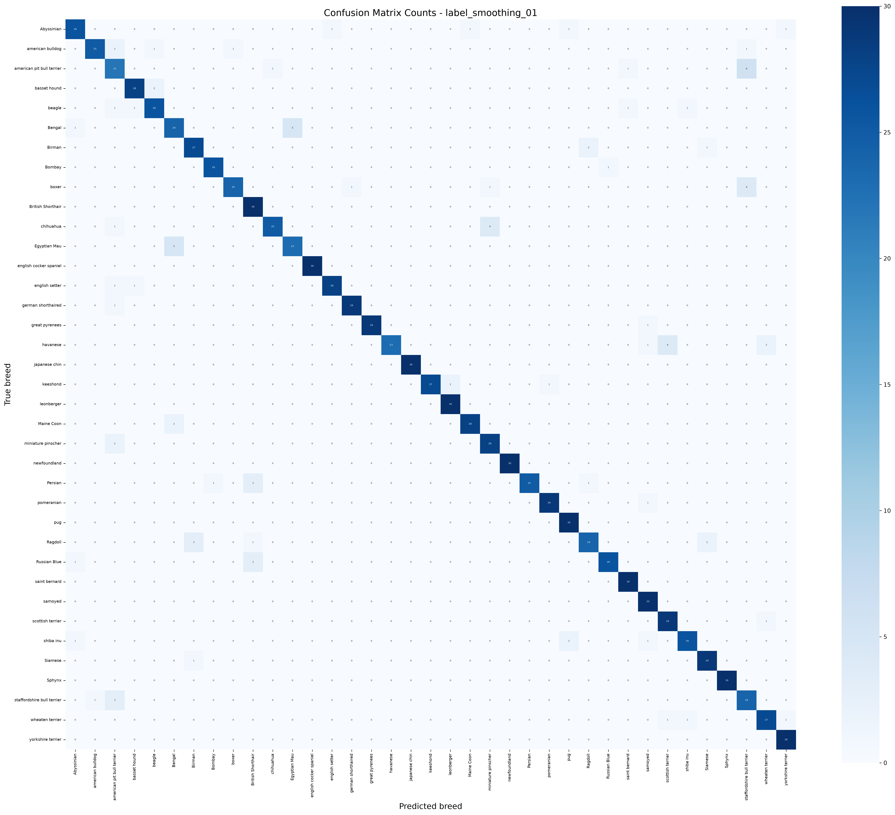
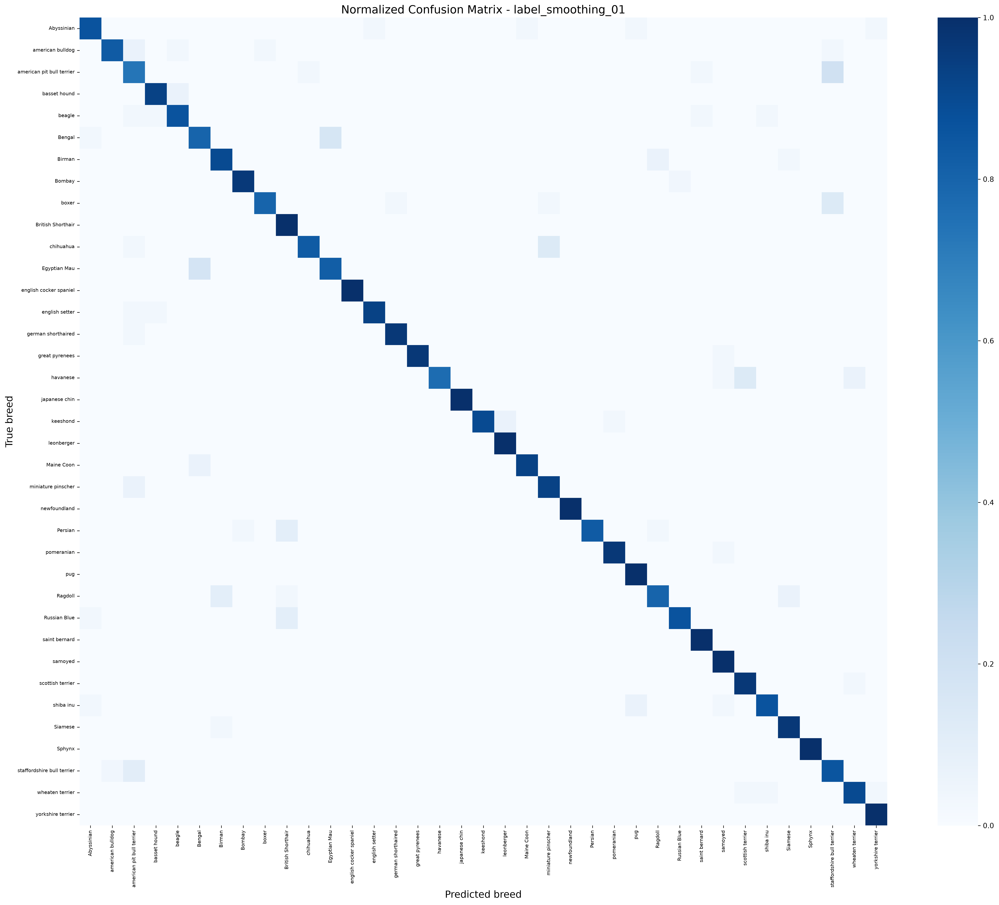
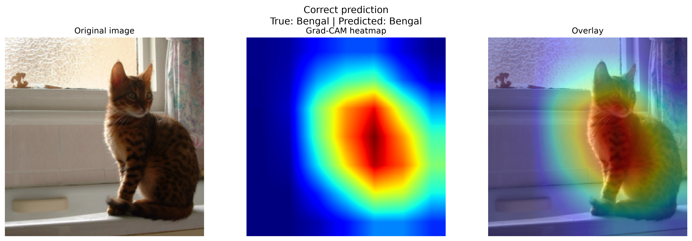
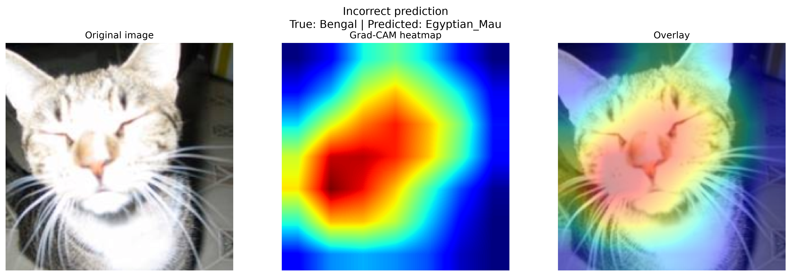

# Pet Classifier

基于 ImageNet 预训练 ResNet18，对 Oxford-IIIT Pet 数据集中的 37 个猫狗品种进行细粒度图像分类。

本项目在相同模型、数据划分和训练超参数下比较三组实验：

- **Baseline CE**：基础数据增强与标准交叉熵损失；
- **Label Smoothing 0.1**：基础数据增强与标签平滑交叉熵；
- **RandAugment N2 M9**：在基础数据增强上加入 `RandAugment(num_ops=2, magnitude=9)`，使用标准交叉熵。

仓库包含数据下载与固定划分、训练、测试评估、Top-1/Top-5、Macro-F1、混淆矩阵、Grad-CAM、TensorBoard 日志和训练曲线导出工具。

## 实验结果

三组实验均训练 10 个 Epoch，并根据验证准确率保存最佳 checkpoint。测试集仅用于最终评估，不参与模型选择。

| 实验 | 训练增强 | Label Smoothing | 最佳 Epoch | 验证准确率 | 测试 Top-1 | 测试 Top-5 | Macro-F1 |
|---|---|---:|---:|---:|---:|---:|---:|
| Baseline CE | Basic | 0.0 | 7 | 92.20% | 91.02% | 99.18% | 0.9098 |
| Label Smoothing 0.1 | Basic | 0.1 | 10 | **92.74%** | **91.30%** | 98.91% | **0.9130** |
| RandAugment N2 M9 | Basic + RandAugment | 0.0 | 8 | 91.65% | 91.21% | **99.27%** | 0.9113 |

与 Baseline 相比：

- Label Smoothing 的测试 Top-1 提高约 0.27 个百分点，Macro-F1 提高约 0.0032，Top-5 降低约 0.27 个百分点；
- RandAugment 的测试 Top-1 提高约 0.18 个百分点，Top-5 提高约 0.09 个百分点，Macro-F1 提高约 0.0015，但验证准确率降低约 0.54 个百分点。

这些差异很小。例如，在 1103 张测试图片上，RandAugment 相比 Baseline 的 Top-1 提升约对应多识别正确 2 张图片。本项目只运行了单一随机种子，因此不宣称差异具有统计显著性。

## 过拟合与正则化观察

各模型在最佳验证 Epoch 的训练—验证准确率差距如下：

| 实验 | 最佳 Epoch 训练准确率 | 最佳验证准确率 | 训练—验证差距 |
|---|---:|---:|---:|
| Baseline CE | 98.48% | 92.20% | 6.29 个百分点 |
| Label Smoothing 0.1 | 99.05% | 92.74% | 6.31 个百分点 |
| RandAugment N2 M9 | 95.80% | 91.65% | **4.15 个百分点** |

RandAugment 将该差距相对 Baseline 缩小约 2.14 个百分点，说明更强的数据增强增加了训练难度，表现出一定的正则化效果。不过，RandAugment 的最佳验证准确率没有超过 Baseline，且第 9、10 个 Epoch 的验证指标出现波动，因此不能据此认为过拟合已经消失或性能得到显著提升。

还需注意：RandAugment 的训练准确率是在随机增强后的训练图片上统计的，输入本身比验证图片更难。因此，较小的训练—验证差距可作为正则化现象的证据之一，但不能单独作为过拟合被消除的证明。

Label Smoothing 改变了交叉熵损失的定义，其 Loss 绝对值不应与普通交叉熵实验直接比较。

## 数据集与固定划分

使用 Oxford-IIIT Pet 数据集，共 7349 张图片、37 个类别。

项目将官方 `trainval` 和 `test` 合并，再使用固定种子 42 进行分层划分：

| 数据集 | 图片数量 | 占比 |
|---|---:|---:|
| 训练集 | 5144 | 70.00% |
| 验证集 | 1102 | 15.00% |
| 测试集 | 1103 | 15.01% |

三个子集互不重叠，并且都包含全部 37 个类别。整数取整使测试集显示为 15.01%。该划分不同于数据集官方默认的训练/测试划分，因此结果不应直接与官方划分下的成绩比较。

### 训练集增强

`basic` 配置：

```text
Resize(256)
RandomCrop(224)
RandomHorizontalFlip()
ToTensor()
ImageNet Normalize
```

`randaugment` 配置在 `basic` 的基础上增加：

```text
RandAugment(num_ops=2, magnitude=9)
```

其中 `num_ops=2` 表示每次随机选择两个增强操作，`magnitude=9` 表示增强强度。

### 验证集和测试集预处理

```text
Resize(256)
CenterCrop(224)
ToTensor()
ImageNet Normalize
```

验证集和测试集始终使用确定性预处理，不使用随机裁剪、随机翻转或 RandAugment。

## 项目结构

```text
pet-classifier/
├── data/
│   ├── __init__.py
│   └── dataset.py
├── models/
│   ├── __init__.py
│   └── model.py
├── utils/
│   ├── __init__.py
│   ├── checkpoints.py
│   ├── metrics.py
│   └── gradcam.py
├── tools/
│   └── export_tensorboard_curves.py
├── outputs/
├── runs/
├── train.py
├── evaluate.py
├── requirements.txt
├── .gitignore
└── README.md
```

主要文件：

- `data/dataset.py`：数据下载、固定分层划分、两种训练增强和 DataLoader；
- `models/model.py`：ResNet18 模型和 37 类输出层；
- `train.py`：参数化训练入口、TensorBoard 记录和最佳模型保存；
- `evaluate.py`：三个模型的测试集指标和混淆矩阵；
- `utils/checkpoints.py`：类别顺序和 checkpoint 加载；
- `utils/metrics.py`：Top-1、Top-5、Macro-F1 和混淆矩阵工具；
- `utils/gradcam.py`：Grad-CAM 计算、样本选择和可视化；
- `tools/export_tensorboard_curves.py`：校验 TensorBoard 日志并导出三组训练曲线。

## 环境要求

本项目实际运行环境：

- Python 3.12；
- PyTorch 2.13.0；
- torchvision 0.28.0；
- CUDA 12.6；
- Windows 11；
- NVIDIA GeForce RTX 4060 Laptop GPU。

没有 CUDA GPU 时程序会使用 CPU，但训练速度会明显变慢。不同 GPU、CUDA、驱动和底层算法可能造成小幅数值差异，复现结果不要求与参考结果小数位完全一致。

## 从头复现三组实验

以下命令以 Windows PowerShell 为例。请在项目根目录执行命令，不要在缺少参数时直接点击运行 `train.py`，因为 `--experiment-name` 是必填参数。

### 1. 克隆仓库

```powershell
git clone https://github.com/peak9331/pet-classifier.git
Set-Location .\pet-classifier
```

### 2. 创建环境并安装依赖

```powershell
conda create -n pet-classifier python=3.12 -y
conda activate pet-classifier
python -m pip install -r .\requirements.txt
python -m pip check
```

### 3. 下载并检查数据集

```powershell
python -c "from data.dataset import create_dataloaders; create_dataloaders(download=True)"
```

数据默认下载到：

```text
datasets/oxford-iiit-pet/
```

成功后应显示：

```text
总数据：7349
训练集：5144
验证集：1102
测试集：1103
类别数：37
```

训练、评估和 Grad-CAM 默认只读取本地数据，不会在运行过程中重复下载。

### 4. 训练 Baseline CE

```powershell
python .\train.py `
    --experiment-name baseline_ce `
    --epochs 10 `
    --batch-size 32 `
    --lr 1e-4 `
    --weight-decay 0.01 `
    --label-smoothing 0.0 `
    --augmentation basic `
    --seed 42 `
    --num-workers 0
```

输出模型：

```text
checkpoints/baseline_ce_best.pth
```

### 5. 训练 Label Smoothing 0.1

```powershell
python .\train.py `
    --experiment-name label_smoothing_01 `
    --epochs 10 `
    --batch-size 32 `
    --lr 1e-4 `
    --weight-decay 0.01 `
    --label-smoothing 0.1 `
    --augmentation basic `
    --seed 42 `
    --num-workers 0
```

输出模型：

```text
checkpoints/label_smoothing_01_best.pth
```

### 6. 训练 RandAugment N2 M9

```powershell
python .\train.py `
    --experiment-name randaugment_n2_m9 `
    --epochs 10 `
    --batch-size 32 `
    --lr 1e-4 `
    --weight-decay 0.01 `
    --label-smoothing 0.0 `
    --augmentation randaugment `
    --seed 42 `
    --num-workers 0
```

输出模型：

```text
checkpoints/randaugment_n2_m9_best.pth
```

如果同名 checkpoint 已存在，训练程序默认拒绝覆盖。请确认文件来源并使用新的实验名称，不要为了绕过提示而随意加入 `--overwrite`。

## 统一测试评估

三组训练全部完成后运行：

```powershell
python .\evaluate.py
```

评估程序依次读取：

```text
checkpoints/baseline_ce_best.pth
checkpoints/label_smoothing_01_best.pth
checkpoints/randaugment_n2_m9_best.pth
```

并计算：

- 测试集 Top-1 Accuracy；
- 测试集 Top-5 Accuracy；
- 测试集 Macro-F1；
- 数量混淆矩阵；
- 归一化混淆矩阵；
- 最容易混淆的类别组合。

当前电脑的复现结果保存到：

```text
outputs/reproduced_experiment_results.csv
```

仓库中的 `outputs/experiment_results.csv` 保存作者的参考结果，不会被本地复现过程自动覆盖。

## TensorBoard 与曲线导出

查看训练日志：

```powershell
tensorboard --logdir .\runs --port 6006
```

浏览器访问：

```text
http://localhost:6006
```

三个 checkpoint 和三组完整日志均存在后，可以导出曲线：

```powershell
python .\tools\export_tensorboard_curves.py `
    --output .\outputs\training_curves_reproduced.png
```

显式使用新的输出文件名，可以避免覆盖仓库中的参考曲线。导出脚本会检查四条曲线是否完整覆盖 1～10 个 Epoch，并核对日志中的最佳验证结果与 checkpoint 是否一致。

## Grad-CAM

运行：

```powershell
python -m utils.gradcam
```

默认读取：

```text
checkpoints/label_smoothing_01_best.pth
```

程序会寻找：

- 一张正确分类的 Bengal 图片；
- 一张被误判为 Egyptian Mau 的 Bengal 图片。

如果明确需要重新生成并覆盖已有 Grad-CAM 图片：

```powershell
python -m utils.gradcam --overwrite
```

## 可视化结果

### 三组训练曲线



对应的曲线来源、逐 Epoch 原始数值和文件哈希记录在：

```text
outputs/training_curves_3_experiments.sources.json
```

### 数量混淆矩阵



### 归一化混淆矩阵



### Grad-CAM 正确案例



### Grad-CAM 错误案例



## 最容易混淆的类别

Label Smoothing 模型中错误次数最多的类别组合：

| 排名 | 类别组合 | 双向错误数 |
|---:|---|---:|
| 1 | Bengal ↔ Egyptian Mau | 10 |
| 2 | American Pit Bull Terrier ↔ Staffordshire Bull Terrier | 9 |
| 3 | Birman ↔ Ragdoll | 5 |
| 4 | Boxer ↔ Staffordshire Bull Terrier | 4 |
| 5 | Chihuahua ↔ Miniature Pinscher | 4 |

完整结果见：

```text
outputs/top_confusions_label_smoothing_01.csv
```

## 主要输出文件

| 文件 | 内容 |
|---|---|
| `outputs/experiment_results.csv` | 作者三组实验的参考指标 |
| `outputs/reproduced_experiment_results.csv` | 当前电脑重新训练和评估得到的指标，默认不提交 |
| `outputs/training_curves_3_experiments.png` | 三组训练/验证 Loss 与 Accuracy 曲线 |
| `outputs/training_curves_3_experiments.sources.json` | 曲线来源、逐 Epoch 数值和哈希 |
| `outputs/confusion_matrix_label_smoothing_01_counts.png` | Label Smoothing 数量混淆矩阵 |
| `outputs/confusion_matrix_label_smoothing_01_normalized.png` | Label Smoothing 归一化混淆矩阵 |
| `outputs/top_confusions_label_smoothing_01.csv` | Label Smoothing 易混淆类别对 |
| `outputs/gradcam_correct_bengal.png` | Bengal 正确分类案例的 Grad-CAM |
| `outputs/gradcam_incorrect_bengal_as_egyptian_mau.png` | Bengal 误判为 Egyptian Mau 的 Grad-CAM |

## 仓库文件策略

数据集和模型 checkpoint 体积较大，不包含在 GitHub 仓库中：

- `datasets/` 通过项目提供的命令下载；
- `checkpoints/` 通过三条训练命令重新生成；
- `runs/` 由训练过程生成，可使用 TensorBoard 查看；
- 仓库保留代码、依赖说明、参考指标、训练曲线、混淆矩阵和 Grad-CAM 图片。

复现者应使用相同参数完成三组训练，再运行统一评估。由于硬件和底层计算差异，结果允许出现小幅波动。
